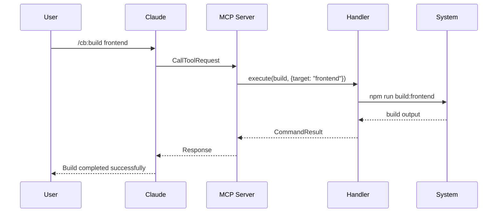

# 🏗️ Arquitetura Técnica - CulturaBuilder

> **Versão**: 1.0.0 | **Última atualização**: Agosto 2024

## 📋 Índice

1. [Visão Geral](#visão-geral)
2. [Componentes Principais](#componentes-principais)
3. [Fluxo de Dados](#fluxo-de-dados)
4. [MCP Server](#mcp-server)
5. [Sistema de Comandos](#sistema-de-comandos)
6. [Integração com Claude](#integração-com-claude)
7. [Estrutura de Diretórios](#estrutura-de-diretórios)
8. [Tecnologias Utilizadas](#tecnologias-utilizadas)
9. [Padrões de Desenvolvimento](#padrões-de-desenvolvimento)
10. [Segurança](#segurança)

---

## 🎯 Visão Geral

CulturaBuilder é um sistema modular baseado no Model Context Protocol (MCP) que estende as capacidades do Claude Desktop e Claude Code com comandos especializados para desenvolvimento.

### Arquitetura de Alto Nível

```
┌─────────────────────────────────────────────────────┐
│                   User Interface                      │
│  ┌──────────────┐         ┌──────────────────────┐  │
│  │Claude Desktop│         │   Claude Code (CLI)   │  │
│  └──────┬───────┘         └──────────┬───────────┘  │
│         │                            │               │
└─────────┼────────────────────────────┼──────────────┘
          │                            │
          ▼                            ▼
┌─────────────────────────────────────────────────────┐
│              Model Context Protocol (MCP)            │
│  ┌────────────────────────────────────────────────┐ │
│  │           CulturaBuilder MCP Server            │ │
│  │  ┌──────────┐  ┌──────────┐  ┌──────────┐    │ │
│  │  │ Commands │  │ Handlers │  │  Router  │    │ │
│  │  └──────────┘  └──────────┘  └──────────┘    │ │
│  └────────────────────────────────────────────────┘ │
└──────────────────────────────────────────────────────┘
          │
          ▼
┌─────────────────────────────────────────────────────┐
│                  Command Registry                     │
│  ┌────────────────────────────────────────────────┐ │
│  │         ~/.claude/commands/cb/*.md             │ │
│  └────────────────────────────────────────────────┘ │
└──────────────────────────────────────────────────────┘
```

### Princípios Arquiteturais

1. **Modularidade**: Componentes independentes e reutilizáveis
2. **Extensibilidade**: Fácil adição de novos comandos
3. **Bilinguismo**: Suporte nativo para PT-BR e EN-US
4. **Performance**: Resposta < 100ms para comandos
5. **Segurança**: Validação e sanitização de inputs

---

## 🔧 Componentes Principais

### 1. MCP Server (TypeScript)

```typescript
// culturabuilder-mcp/src/index.ts
class CulturaBuilderServer {
  commands: CommandRegistry
  handlers: CommandHandlers
  transport: StdioServerTransport
  
  async initialize() {
    // Registra comandos
    // Configura handlers
    // Inicia transport
  }
}
```

**Responsabilidades**:
- Registrar comandos no Claude Desktop
- Processar requisições via MCP
- Executar handlers de comandos
- Gerenciar comunicação stdio

### 2. Command Registry

```typescript
interface Command {
  name: string
  description: string
  args: string[]
  examples: string[]
  handler: CommandHandler
}

class CommandRegistry {
  private commands: Map<string, Command>
  
  register(command: Command): void
  execute(name: string, args: any[]): Promise<Result>
  list(): Command[]
}
```

**Responsabilidades**:
- Manter registro de comandos disponíveis
- Validar argumentos de comandos
- Rotear execução para handlers
- Fornecer metadados de comandos

### 3. Command Handlers

```typescript
type CommandHandler = (args: CommandArgs) => Promise<CommandResult>

interface CommandArgs {
  params: Record<string, any>
  context: ExecutionContext
  config: Configuration
}

interface CommandResult {
  success: boolean
  output: string | object
  error?: Error
}
```

**Responsabilidades**:
- Executar lógica específica de cada comando
- Validar parâmetros
- Retornar resultados formatados
- Gerenciar erros

### 4. Transport Layer

```typescript
class StdioServerTransport {
  async connect(): Promise<void>
  async send(message: Message): Promise<void>
  async receive(): Promise<Message>
  async close(): Promise<void>
}
```

**Responsabilidades**:
- Comunicação via stdin/stdout
- Serialização/deserialização de mensagens
- Gerenciamento de conexão
- Buffer management

---

## 📊 Fluxo de Dados

### Fluxo de Execução de Comando



### Estados do Sistema

```
┌─────────┐     ┌──────────┐     ┌──────────┐
│  IDLE   │────▶│ PROCESSING│────▶│ COMPLETE │
└─────────┘     └──────────┘     └──────────┘
     ▲               │                  │
     │               ▼                  │
     │          ┌──────────┐           │
     └──────────│  ERROR   │◀──────────┘
                └──────────┘
```

---

## 🔌 MCP Server

### Estrutura do Servidor

```typescript
// culturabuilder-mcp/src/index.ts
import { Server } from "@modelcontextprotocol/sdk/server/index.js"
import { StdioServerTransport } from "@modelcontextprotocol/sdk/server/stdio.js"

const server = new Server(
  {
    name: "culturabuilder",
    version: "1.0.0",
  },
  {
    capabilities: {
      tools: {},
    },
  }
)

// Registra handlers
server.setRequestHandler(ListToolsRequestSchema, listToolsHandler)
server.setRequestHandler(CallToolRequestSchema, callToolHandler)
```

### Configuração

```json
// ~/.claude/claude_desktop_config.json
{
  "mcpServers": {
    "culturabuilder": {
      "command": "node",
      "args": ["/path/to/culturabuilder-mcp/dist/index.js"],
      "env": {
        "CULTURABUILDER_LANG": "pt-BR",
        "CULTURABUILDER_DEBUG": "false"
      }
    }
  }
}
```

### Comunicação MCP

```typescript
// Protocolo de comunicação
interface MCPMessage {
  jsonrpc: "2.0"
  method: string
  params?: any
  id?: number
}

// Request
{
  "jsonrpc": "2.0",
  "method": "tools/call",
  "params": {
    "name": "/cb:build",
    "arguments": {"target": "frontend"}
  },
  "id": 1
}

// Response
{
  "jsonrpc": "2.0",
  "result": {
    "content": [{
      "type": "text",
      "text": "Build completed successfully"
    }]
  },
  "id": 1
}
```

---

## 📝 Sistema de Comandos

### Estrutura de Comando

```markdown
<!-- ~/.claude/commands/cb/build.md -->
---
allowed-tools: ['Read', 'Write', 'Edit', 'Bash']
description: "Constrói componentes do projeto"
args:
  - target: string
  - optimize: boolean
  - clean: boolean
---

# /cb:build

## Descrição
Constrói componentes do projeto com detecção automática de framework.

## Uso
/cb:build [target] [--optimize] [--clean]

## Exemplos
- /cb:build frontend
- /cb:build --all --optimize
```

### Registro de Comandos

```typescript
const CULTURABUILDER_COMMANDS: Record<string, CommandDefinition> = {
  "/cb:build": {
    description: "🔨 Constrói componentes do projeto",
    args: ["target", "--optimize", "--clean", "--type"],
    examples: ["/cb:build frontend", "/cb:build --all"],
    handler: buildHandler
  },
  // ... outros 24 comandos
}
```

### Ciclo de Vida do Comando

```
1. Parse     → Analisa comando e argumentos
2. Validate  → Valida sintaxe e permissões
3. Prepare   → Prepara contexto de execução
4. Execute   → Executa handler do comando
5. Process   → Processa resultado
6. Format    → Formata saída
7. Return    → Retorna para Claude
```

---

## 🤝 Integração com Claude

### Claude Desktop Integration

```typescript
// Integração via MCP
class ClaudeDesktopIntegration {
  private mcpServer: MCPServer
  
  async initialize() {
    // Detecta Claude Desktop
    const claudePath = await this.findClaudeDesktop()
    
    // Configura MCP
    await this.configureMCP(claudePath)
    
    // Registra comandos
    await this.registerCommands()
  }
}
```

### Claude Code Integration

```bash
# Terminal integration
claude() {
  # Wrapper function para Claude Code
  command claude "$@"
}

# Uso
claude
> /cb:build frontend
```

### Sincronização de Estado

```typescript
interface SessionState {
  currentProject: string
  language: "pt-BR" | "en-US"
  theme: "dark" | "light"
  history: CommandHistory[]
}

class StateManager {
  private state: SessionState
  
  sync(): void
  persist(): void
  restore(): void
}
```

---

## 📁 Estrutura de Diretórios

```
CulturaBuilder/
├── culturabuilder-mcp/           # Servidor MCP
│   ├── src/
│   │   ├── index.ts             # Entry point
│   │   ├── commands/            # Handlers de comandos
│   │   │   ├── build.ts
│   │   │   ├── analyze.ts
│   │   │   └── ...
│   │   ├── utils/               # Utilidades
│   │   │   ├── validator.ts
│   │   │   ├── formatter.ts
│   │   │   └── logger.ts
│   │   └── types/               # TypeScript types
│   │       ├── commands.ts
│   │       └── mcp.ts
│   ├── dist/                    # JavaScript compilado
│   ├── tests/                   # Testes unitários
│   ├── package.json
│   └── tsconfig.json
├── docs/                        # Documentação
│   ├── DOCUMENTATION.md
│   ├── COMMANDS_REFERENCE.md
│   ├── ARCHITECTURE.md
│   └── INSTALLATION_GUIDE.md
├── setup/                       # Scripts de instalação
│   ├── install.py
│   └── configure.sh
└── ~/.claude/                   # Configuração do usuário
    ├── claude_desktop_config.json
    └── commands/
        └── cb/                  # Definições de comandos
            ├── build.md
            ├── analyze.md
            └── ...
```

---

## 🛠️ Tecnologias Utilizadas

### Core Technologies

| Tecnologia | Versão | Uso |
|------------|--------|-----|
| TypeScript | 5.0+ | Linguagem principal do MCP Server |
| Node.js | 18+ | Runtime do servidor |
| MCP SDK | 1.0+ | Protocolo de comunicação |
| Markdown | - | Definição de comandos |

### Dependências

```json
{
  "dependencies": {
    "@modelcontextprotocol/sdk": "^1.0.0",
    "commander": "^11.0.0",
    "chalk": "^5.3.0",
    "winston": "^3.10.0"
  },
  "devDependencies": {
    "@types/node": "^20.0.0",
    "typescript": "^5.0.0",
    "jest": "^29.0.0",
    "eslint": "^8.0.0"
  }
}
```

### Build Pipeline

```bash
# Desenvolvimento
npm run dev      # TypeScript watch mode
npm run test     # Jest tests
npm run lint     # ESLint

# Produção
npm run build    # Compila TypeScript
npm run start    # Inicia servidor
```

---

## 📐 Padrões de Desenvolvimento

### Padrões de Código

```typescript
// Naming Conventions
class CommandHandler {}      // PascalCase para classes
interface ICommand {}        // Interface com prefixo I
const MAX_RETRIES = 3       // UPPER_CASE para constantes
let commandName: string      // camelCase para variáveis

// Estrutura de módulo
export class BuildCommand implements ICommand {
  private readonly config: Config
  
  constructor(config: Config) {
    this.config = config
  }
  
  async execute(args: CommandArgs): Promise<Result> {
    // Implementação
  }
}
```

### Padrões de Erro

```typescript
class CommandError extends Error {
  constructor(
    message: string,
    public code: string,
    public context?: any
  ) {
    super(message)
    this.name = 'CommandError'
  }
}

// Uso
throw new CommandError(
  'Build failed',
  'BUILD_ERROR',
  { target: 'frontend' }
)
```

### Padrões de Logging

```typescript
import winston from 'winston'

const logger = winston.createLogger({
  level: process.env.LOG_LEVEL || 'info',
  format: winston.format.json(),
  transports: [
    new winston.transports.File({ filename: 'error.log', level: 'error' }),
    new winston.transports.File({ filename: 'combined.log' })
  ]
})

// Uso
logger.info('Command executed', { command: '/cb:build', args })
logger.error('Command failed', { error, context })
```

---

## 🔒 Segurança

### Validação de Input

```typescript
class InputValidator {
  static validateCommand(input: string): boolean {
    // Previne injection
    const pattern = /^\/cb:[a-z-]+(\s+[a-zA-Z0-9-_.\/]+)*$/
    return pattern.test(input)
  }
  
  static sanitizeArgs(args: any): any {
    // Remove caracteres perigosos
    // Valida tipos
    // Limita tamanhos
  }
}
```

### Permissões

```typescript
interface CommandPermissions {
  allowedTools: string[]
  requiresAuth: boolean
  maxExecutionTime: number
  rateLimit: number
}

// Exemplo
const buildPermissions: CommandPermissions = {
  allowedTools: ['Read', 'Write', 'Bash'],
  requiresAuth: false,
  maxExecutionTime: 300000, // 5 minutos
  rateLimit: 10 // por minuto
}
```

### Auditoria

```typescript
class AuditLogger {
  log(event: AuditEvent): void {
    // Registra comando executado
    // Usuário
    // Timestamp
    // Resultado
    // Erros
  }
}
```

---

## 🚀 Performance

### Otimizações

1. **Caching de comandos**: Comandos frequentes em memória
2. **Lazy loading**: Carrega handlers sob demanda
3. **Connection pooling**: Reutiliza conexões
4. **Async/await**: Operações não-bloqueantes
5. **Stream processing**: Para outputs grandes

### Métricas

```typescript
interface PerformanceMetrics {
  commandExecutionTime: number
  memoryUsage: number
  cpuUsage: number
  throughput: number
}

class MetricsCollector {
  collect(): PerformanceMetrics
  report(): void
}
```

### Benchmarks

| Operação | Tempo Médio | Meta |
|----------|-------------|------|
| Inicialização | 150ms | <200ms |
| Comando simples | 50ms | <100ms |
| Build completo | 30s | <60s |
| Análise profunda | 5s | <10s |

---

## 📈 Escalabilidade

### Estratégias

1. **Horizontal scaling**: Múltiplas instâncias do MCP Server
2. **Load balancing**: Distribuição de comandos
3. **Queue system**: Para comandos pesados
4. **Microservices**: Handlers como serviços separados
5. **CDN**: Para recursos estáticos

### Limites

```typescript
const LIMITS = {
  MAX_CONCURRENT_COMMANDS: 10,
  MAX_COMMAND_SIZE: 1024 * 1024, // 1MB
  MAX_OUTPUT_SIZE: 10 * 1024 * 1024, // 10MB
  COMMAND_TIMEOUT: 5 * 60 * 1000, // 5 minutos
  RATE_LIMIT_PER_MINUTE: 60
}
```

---

## 🔄 Versionamento

### Semantic Versioning

```
MAJOR.MINOR.PATCH

1.0.0 - Release inicial
1.1.0 - Novos comandos adicionados
1.1.1 - Correções de bugs
2.0.0 - Breaking changes na API
```

### Compatibilidade

```typescript
interface VersionCompatibility {
  minClaudeVersion: "1.0.0"
  maxClaudeVersion: "2.0.0"
  mcpProtocolVersion: "1.0"
  nodeVersion: ">=18.0.0"
}
```

---

## 📝 Notas de Implementação

### Próximas Melhorias

1. **WebSocket support**: Comunicação em tempo real
2. **Plugin system**: Comandos de terceiros
3. **AI integration**: Sugestões inteligentes
4. **Cloud sync**: Sincronização de configurações
5. **Multi-language**: Mais idiomas além de PT-BR/EN-US

### Débito Técnico

- [ ] Migrar para ESM modules
- [ ] Adicionar mais testes unitários
- [ ] Melhorar documentação inline
- [ ] Implementar circuit breaker
- [ ] Adicionar telemetria

---

**Última atualização**: 08 de Agosto de 2024 | **Versão**: 1.0.0
---
CulturaBuilder
